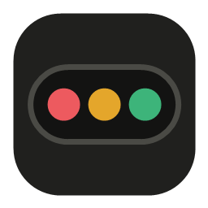
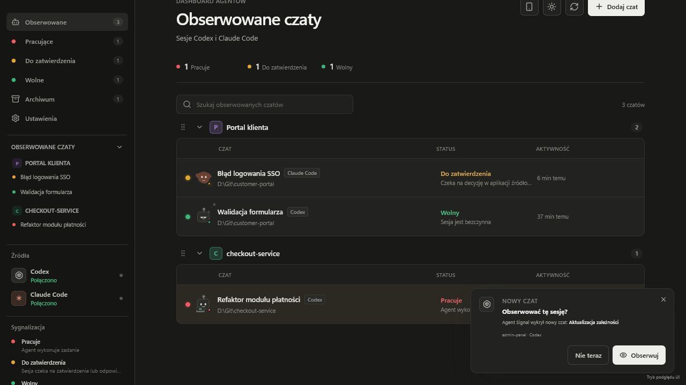
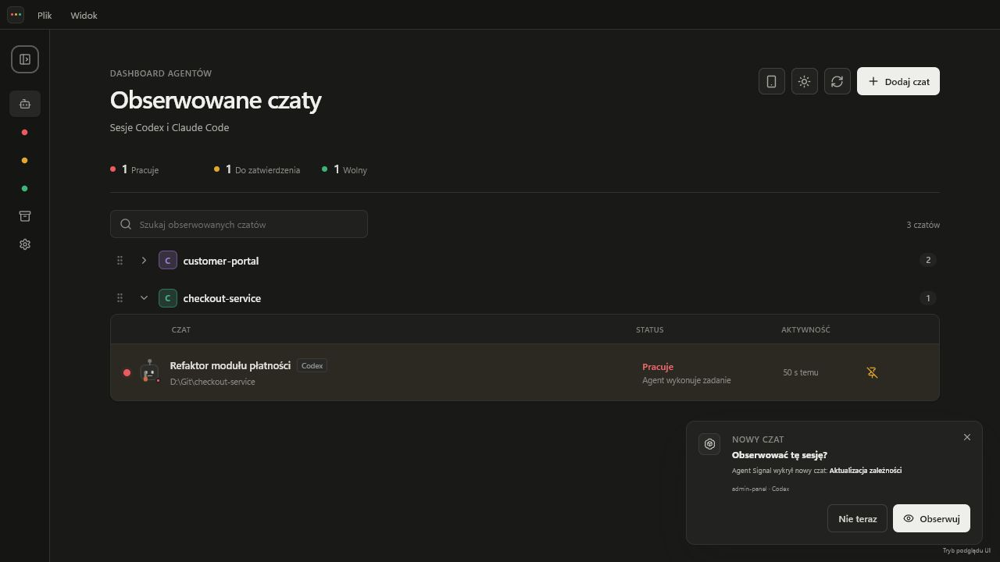
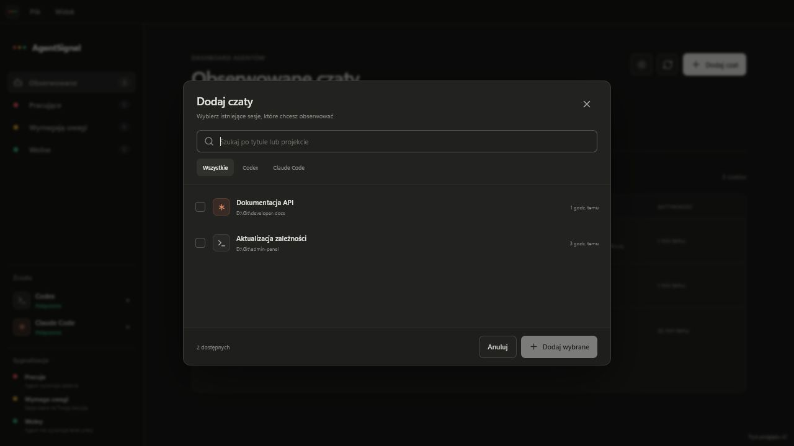
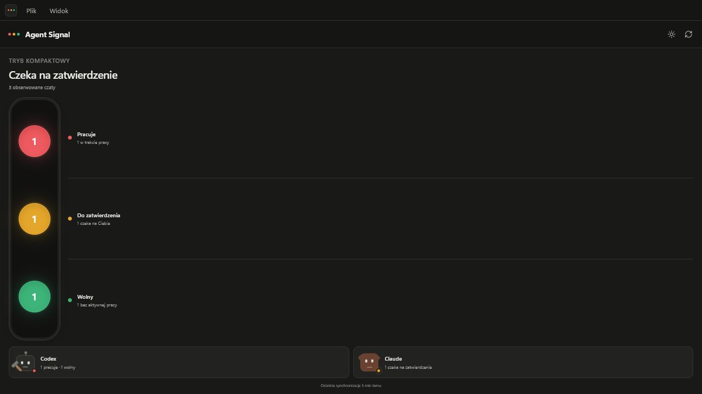
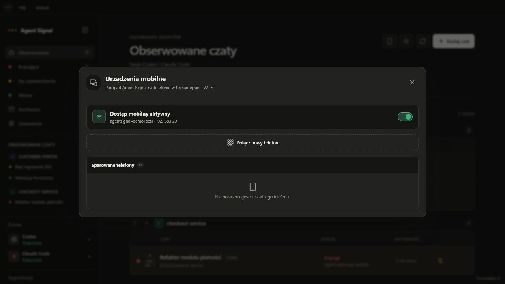

<p align="center">
  
</p>

<h1 align="center">Agent Signal</h1>

<p align="center">
  A calm, local desktop dashboard for the Codex and Claude Code chats you want to keep an eye on.
</p>

<p align="center">
  
  
  
  
  
</p>

Agent Signal is a companion dashboard, not another chat client. It discovers
existing local Codex and Claude Code sessions, lets you choose which ones to
watch, and keeps their state readable at a glance. It never sends prompts,
answers approval requests, or deletes the source conversation.



> Every screenshot in this README uses built-in demonstration data. No real
> conversation, account, or local project path is shown.

## What is new in 0.6.1

Version 0.6.1 turns the flat watch list into a configurable project workspace:

- project grouping in the dashboard and in the Add chat window;
- optional automatic project detection from each session's working directory;
- editable project names, badge letters, and badge colors;
- persistent drag-and-drop project ordering;
- independently collapsible project sections;
- a collapsible watched-chat list and a compact icon-only sidebar;
- pinned chats, direct Open buttons, and optional double-click navigation;
- detection of newly opened chats with an optional bottom-right watch prompt;
- a Settings view for the project's organization, navigation, discovery,
  notifications, language, and pet behavior;
- naturally written Polish and English interface copy;
- sleeping pets after a configurable idle period, set to 15 minutes by default;
- a corrected approval state that requires an explicit approval or input signal;
- optional muting of approval-wait notifications without hiding the status;
- larger, higher-contrast UI text, including the mobile-device dialog;
- a refined Codex pet and hammer animation with no clipped swing;
- a clearer Agent Signal application icon and correctly separated product name
  in the Windows installer;
- a subtle status-colored halo around the compact traffic lights.

## Dashboard

### Projects that fit your workflow

Automatic grouping is available immediately, but every project can be made
personal. Hover a project header to edit its displayed name, one-character
badge, and color. Drag the handle to arrange projects in your preferred order.
The order, presentation, and collapsed state are stored locally.

Each group can be folded independently. The whole navigation column can also
collapse to an icon rail when screen space matters.



### Add and open chats

Choose **Dodaj czat** / **Add chat** to browse sessions found in local Codex and
Claude Code history. The picker can organize candidates by project before you
decide which conversations to watch.



Adding, archiving, or removing a dashboard entry does not modify the original
conversation. A watched chat can be opened through its row action or, when
enabled, by double-clicking anywhere on the row.

### Pins, search, and archive

Pinned chats stay at the top of their project. Search filters the watched list
without changing its organization. Finished chats can be moved to the local
archive, restored later, or removed permanently from Agent Signal's dashboard.

### New-chat discovery

Agent Signal can listen for sessions that appear while it is running. An
optional prompt in the lower-right corner asks whether the new chat should be
watched. Both discovery and the prompt can be switched off independently.

## Status model

| Color | Status | Meaning |
| --- | --- | --- |
| Red | Working | The agent is actively executing a turn. |
| Yellow | Approval needed | The source explicitly reports an unresolved approval or user-input request. |
| Green | Idle | The agent is not currently working. |
| Gray | Unavailable | Agent Signal cannot confirm the current state. |

Codex sessions come from the local Codex App Server. For watched conversations,
Agent Signal also incrementally reads the local JSONL event history. A session
enters **Approval needed** only when the App Server reports
`waitingOnApproval` / `waitingOnUserInput`, or when a matching permission or
input tool call is still unresolved. Ordinary reasoning, a running command, or
a quiet log never becomes an approval wait merely because time has passed.

When an approval request is resolved, the dashboard returns to the real current
state. Approval notifications can also be muted separately on desktop and
paired phones, which is useful for brief waits that the source application
handles automatically. The yellow dashboard status remains visible.

Claude Code history comes from the official Claude Agent SDK. Its active state
is currently inferred from the time of the most recent session activity.
Consumer Claude Chat and Cowork conversations are not imported.

## Compact mode

Choose **Widok → Tryb kompaktowy** / **View → Compact mode** for an aggregate
traffic-light display. It shows exact counts for working, approval, and idle
sessions, plus a per-provider summary. Each signal has a restrained colored
halo so its state remains legible without overpowering a dark desktop.



## Pets and idle behavior

Codex and Claude Code have distinct animated status pets. A working pet
animates, an approval state asks for attention, and an idle pet can fall asleep
with a small `zzz` animation. The sleep threshold is configurable from 1 to 120
minutes and defaults to 15 minutes.

## Preferences and languages

The Settings view saves changes automatically. Available controls include:

- Polish or naturally written English interface copy;
- dashboard, picker, and automatic project grouping;
- direct double-click navigation and chat pinning;
- the default expanded state of the watched-chat list;
- new-session listening and the watch prompt;
- system notifications;
- separate approval-wait alerts for desktop and mobile;
- sleeping-pet animation and its idle threshold.

## Mobile dashboard

Agent Signal can serve an installable Android dashboard directly from the
desktop app. There is no Agent Signal cloud account or hosted relay. The
computer continues to read local session sources and sends a privacy-reduced
status snapshot to a paired phone on the same private Wi-Fi network.



### Requirements

- Android 12 or newer with a current Chrome release;
- phone and computer on the same private IPv4 network;
- Agent Signal running on the computer, open or in the Windows tray;
- internet access only when background Web Push delivery is needed.

### Pair a phone

1. Open **Urządzenia mobilne** / **Mobile devices** from the phone button.
2. Enable mobile access and, if Windows asks, allow private-network access.
3. Select **Połącz nowy telefon** / **Connect a new phone**.
4. Scan the certificate QR code and install **Agent Signal Local CA** in
   Android's CA certificate settings.
5. Compare the SHA-256 fingerprint shown by Android with Agent Signal.
6. Scan the second, one-time pairing QR code before it expires after 60 seconds.
7. In Chrome, choose **Add to Home screen** or **Install app**.
8. Open the installed app and optionally enable push notifications.

The pairing link uses the computer's private IPv4 address directly, so Android
does not have to resolve a `.local` hostname. A paired phone reconnects whenever
Agent Signal is available. Individual phones can be revoked, or all mobile
access can be reset, from the desktop dialog.

Closing the desktop window keeps Agent Signal active in the Windows tray.
Choose **Wyjście** / **Exit** from the app or tray menu to stop monitoring and
take the mobile dashboard offline.

## Installation

### Windows installer

1. Open the [latest Agent Signal release](https://github.com/mknizewski/agent-signal/releases/latest).
2. Download `Agent Signal Setup <version>.exe`.
3. Run the installer and choose the installation directory.

The product name is displayed as **Agent Signal** throughout the installer,
Start menu, desktop shortcut, and installed-app list. Version 0.6.1 targets
Windows 10 and Windows 11 on x64 and works with Codex, Claude Code, or both.

### Run from source

Requirements: Node.js 22+ and pnpm 11.

```powershell
git clone https://github.com/mknizewski/agent-signal.git
cd agent-signal
pnpm install
pnpm dev
```

Useful commands:

```powershell
pnpm typecheck         # TypeScript checks
pnpm test              # unit tests
pnpm test:sync-smoke   # local provider integration smoke test
pnpm test:mobile-smoke # paired mobile gateway smoke test
pnpm test:app-smoke    # packaged Windows application smoke test
pnpm build             # production build
pnpm dist              # Windows installer in release/
```

## Privacy and security

Agent Signal is local-first:

- no Agent Signal backend, account, analytics, or telemetry;
- no prompts sent and no automatic approval decisions;
- no modification or deletion of source sessions;
- local Codex App Server connection over `stdio`;
- local Claude Code session listing through the official SDK;
- no public-network listener and no mDNS advertisement;
- authenticated, single-use QR pairing for mobile devices;
- a reduced mobile API without project paths, summaries, archive data, or
  source session identifiers.

Tracked sessions, archived entries, preferences, and project presentation are
stored in `agent-signal-state.json` inside Electron's local application-data
directory. That file can contain titles, local paths, and source identifiers.
Agent Signal never includes it in this repository or uploads it.

The desktop renderer uses context isolation, sandboxing, no Node.js access, a
Content Security Policy, validated IPC operations, blocked pop-up windows, and
denied browser permission requests.

The Android PWA uses a per-installation local CA because service workers and
Web Push require HTTPS. Private certificate and VAPID keys are encrypted with
Electron `safeStorage`. Pairing uses a 256-bit, single-use secret valid for 60
seconds. A persistent phone token is kept in a Secure, HttpOnly, SameSite
cookie; only its hash is stored by Agent Signal.

Web Push payloads contain only a notification title, watched-session title, and
new status. Delivery goes from the running desktop application to the browser's
push endpoint, without an Agent Signal relay.

See [SECURITY.md](SECURITY.md) for vulnerability reporting.

## Current limitations

- Claude Code activity detection is based on the latest activity timestamp.
- Agent Signal does not control agents or respond to approval requests.
- Local history availability depends on the installed Codex and Claude Code
  versions.
- The packaged installer currently targets Windows x64.
- The mobile dashboard currently targets Android 12+ on the same private IPv4
  subnet.
- Guest Wi-Fi networks may block device-to-device traffic.
- Background mobile notifications require the browser's Web Push service.

## Project layout

```text
electron/         Electron main process, provider detection, and synchronization
src/              React UI, shared status models, and mobile interface
docs/screenshots/ README demonstration assets
scripts/          smoke tests and build helpers
build/            application icon assets
```

## Contributing

Issues and focused pull requests are welcome. Please run `pnpm typecheck` and
`pnpm test` before submitting code that changes synchronization or status
behavior, and include updated screenshots for visible UI changes.

## License

[MIT](LICENSE)
