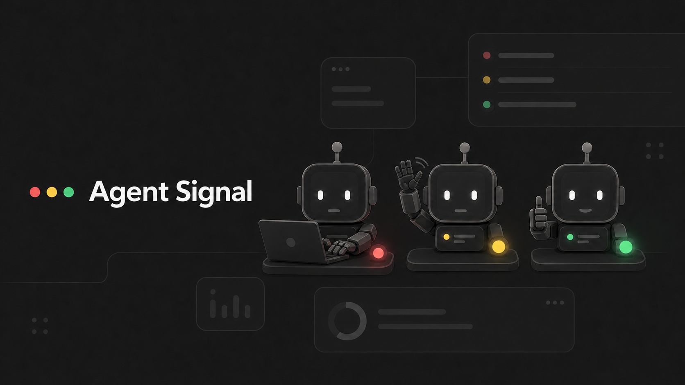
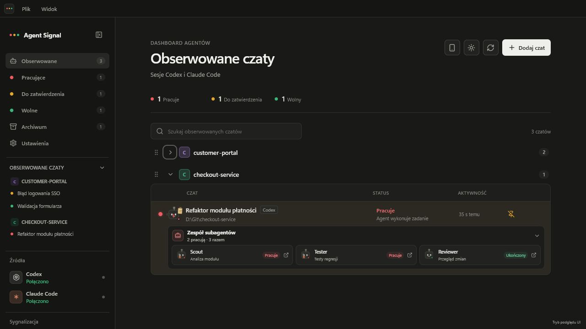
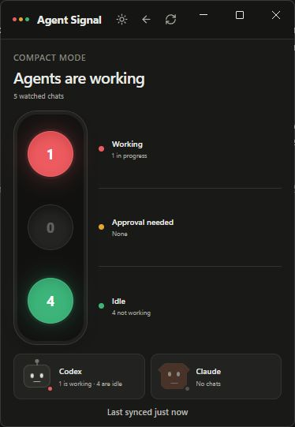
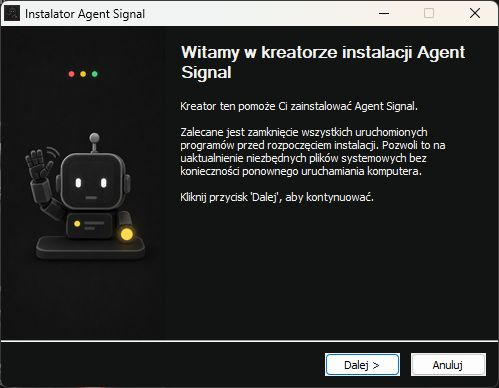
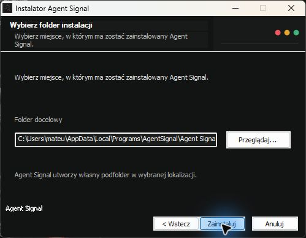

<p align="center">
  
</p>

<h1 align="center">Agent Signal</h1>

<p align="center">
  A calm, local desktop dashboard for the Codex and Claude Code chats that need your attention.
</p>

<p align="center">
  
  
  
  
  
</p>



Agent Signal solves an attention-management problem created by parallel AI
work. When several agents are running across different projects and providers,
the user should not need to keep opening every conversation to find out which
one is working, idle, or blocked on a decision.

The application discovers existing local Codex and Claude Code sessions, lets
the user choose which ones to watch, and presents their state in one consistent
view. It is a companion dashboard, not another chat client: it never sends
prompts, answers approval requests, or modifies source conversations.

<p align="center">
  <a href="https://github.com/mknizewski/agent-signal/releases/latest"><strong>Download for Windows</strong></a>
  ·
  <a href="docs/CASE_STUDY.md"><strong>Read the case study</strong></a>
  ·
  <a href="CHANGELOG.md"><strong>Changelog</strong></a>
  ·
  <a href="SECURITY.md"><strong>Security</strong></a>
</p>


> Every screenshot uses built-in demonstration data. No real conversation,
> account, or local project path is shown.

## Why it exists

Running multiple agents in parallel saves execution time but creates
coordination overhead:

- sessions are distributed across providers, projects, and windows;
- approval requests can wait unnoticed;
- repeatedly checking every chat interrupts focused work;
- provider-specific interfaces do not provide one shared status view;
- transcripts and project paths may be too sensitive for a hosted dashboard.

Agent Signal acts as a local attention router. It reduces each watched session
to a small, conservative state model, notifies the user about meaningful
transitions, and opens the original conversation when action is required.

For the product reasoning, constraints, architecture, and engineering
trade-offs behind this approach, see the
[product and engineering case study](docs/CASE_STUDY.md).

## At a glance

- **Cross-provider monitoring** for local Codex and Claude Code sessions.
- **Reliable attention states** based on explicit lifecycle evidence instead of
  silence or elapsed-time guesses.
- **Project workspace** with automatic or manual grouping, custom names,
  pinning, search, ordering, and archive.
- **Codex and Claude Code subagent visibility** based on explicit local
  parent-child metadata.
- **Desktop and mobile alerts** with a grace period for short-lived approval
  waits.
- **Compact signal view** for an always-visible aggregate status.
- **Local-first operation** without an Agent Signal account, backend,
  analytics, or telemetry.
- **Optional Android dashboard** served directly by the desktop application on
  the same private network.

## Status model

| Color | Status | Meaning |
| --- | --- | --- |
| Red | Working | The source indicates that a turn is still executing. |
| Yellow | Approval needed | An explicit approval or user-input request remains unresolved. |
| Green | Idle | The agent is not currently working. |
| Gray | Unavailable | There is not enough reliable information to claim another state. |

### Codex

Codex sessions come from the local Codex App Server. For watched
conversations, Agent Signal also reads the local JSONL event history
incrementally.

A session enters **Approval needed** only when the App Server reports
`waitingOnApproval` or `waitingOnUserInput`, or when a matching permission or
input tool call remains unresolved. Ordinary reasoning, a running command, or a
quiet log does not become an approval wait merely because time has passed.

### Claude Code

Claude Code history comes from the official Claude Agent SDK. For watched
conversations, Agent Signal incrementally reads the local JSONL transcript and
keeps an open turn in **Working** until Claude records an explicit turn end.
Unresolved `AskUserQuestion` and `ExitPlanMode` calls are shown as
**Approval needed**.

Consumer Claude Chat and Cowork conversations are not imported.

### Notification behavior

The dashboard reflects status immediately. Desktop and mobile notifications
wait 10 seconds before reporting an approval wait, which keeps brief
automatically resolved requests silent. Notification baselines are established
after the initial provider synchronization so a fresh launch does not replay
historical state changes.

## Product tour

### Organize the sessions worth watching

The Add chat window discovers local sessions and can group them by project
before they are added. Watched chats support custom display names, pinning,
search, archiving, and direct navigation to their source application.

Project groups can be detected from the working directory or assigned manually.
Their names, badges, colors, order, and collapsed state are stored locally.


### See subagent teams in context

When a watched Codex chat spawns subagents, Agent Signal attaches them to the
real parent conversation instead of mixing them into the normal chat picker.
Claude Code subagents are attached from the explicit per-session `subagents`
directory stored beside the watched transcript. The team panel shows detected
child roles and includes their count in compact mode.

Codex relationships come from explicit thread-spawn metadata, with a parent
thread read used when the general App Server list has not indexed a fresh
child. Because child lifecycle data can be incomplete, the panel treats
subagents as presence information and does not claim a reliable live status
for each child.



### Keep a compact signal in view

Compact mode reports aggregate working, approval, idle, and provider counts in
a small window. Status pets provide a recognizable visual signal, while the
traffic-light colors and text remain the source of meaning.



## Mobile dashboard preview

Agent Signal can serve an installable Android dashboard directly from the
desktop application. There is no hosted relay: the computer continues to read
local provider data and sends a privacy-reduced status snapshot to a paired
phone on the same private Wi-Fi network.


### Requirements

- Android 12 or newer with a current Chrome release;
- phone and computer on the same private IPv4 network;
- Agent Signal running on the computer, open or in the Windows tray;
- internet access only when background Web Push delivery is needed.

### Pair a phone

1. Open **Urządzenia mobilne** / **Mobile devices**.
2. Enable mobile access and allow private-network access if Windows asks.
3. Select **Połącz nowy telefon** / **Connect a new phone**.
4. Scan the certificate QR code and install **Agent Signal Local CA** in
   Android's CA certificate settings.
5. Compare the SHA-256 fingerprint displayed by Android with Agent Signal.
6. Scan the second, single-use pairing QR code before it expires.
7. In Chrome, choose **Add to Home screen** or **Install app**.
8. Open the installed app and optionally enable push notifications.

Individual phones can be revoked, and all mobile access can be reset from the
desktop application.

## Installation

### Windows installer

1. Open the [latest Agent Signal release](https://github.com/mknizewski/agent-signal/releases/latest).
2. Download `Agent Signal Setup <version>.exe`.
3. Run the installer and follow the bilingual setup wizard.

Version 0.6.4 targets Windows 10 and Windows 11 on x64 and works with Codex,
Claude Code, or both. The GitHub-distributed installer is not currently
Authenticode-signed.

<p align="center">
  
  
</p>

### Run from source

Requirements: Node.js 22+ and pnpm 11.

```powershell
git clone https://github.com/mknizewski/agent-signal.git
cd agent-signal
pnpm install
pnpm dev
```

## Privacy and security

Agent Signal is local-first:

- no Agent Signal backend, account, analytics, or telemetry;
- no prompts sent and no automatic approval decisions;
- no modification or deletion of source sessions;
- local Codex App Server connection over `stdio`;
- local Claude Code session listing through the official SDK;
- no public-network listener and no mDNS advertisement;
- authenticated, single-use QR pairing for mobile devices;
- a reduced mobile API without project paths, summaries, archive data, or
  source session identifiers.

Tracked sessions, archived entries, preferences, and project presentation are
stored in `agent-signal-state.json` inside Electron's local application-data
directory. This file can contain titles, local paths, and source identifiers,
but Agent Signal does not upload it.

The desktop renderer uses context isolation, sandboxing, no Node.js access, a
Content Security Policy, validated IPC operations, blocked pop-up windows, and
denied browser permission requests.

The Android PWA uses a per-installation local CA because service workers and Web
Push require HTTPS. Private certificate and VAPID keys are encrypted with
Electron `safeStorage`. Pairing uses a 256-bit, single-use secret valid for 60
seconds. A persistent phone token is stored in a Secure, HttpOnly, SameSite
cookie; only its hash is retained by Agent Signal.

Web Push payloads contain only a notification title, watched-session title, and
new status. See [SECURITY.md](SECURITY.md) for the complete security notes and
vulnerability-reporting process.

## Current limitations

- Agent Signal observes agents but does not control them or respond to approval
  requests.
- Local history and event availability depend on installed Codex and Claude
  Code versions.
- The packaged installer currently targets Windows x64.
- The mobile dashboard targets Android 12+ on the same private IPv4 subnet.
- Guest Wi-Fi networks can block device-to-device traffic.
- Background mobile notifications depend on the browser's Web Push service.

## Architecture and project layout

The Electron main process owns provider access, persistence, desktop
notifications, and the optional HTTPS mobile gateway. A sandboxed React
renderer receives validated application snapshots through a narrow preload
bridge.

```text
electron/         Electron lifecycle, provider sync, storage, and mobile gateway
src/              React desktop/mobile UI and shared status models
docs/             Product case study and demonstration screenshots
scripts/          Provider, mobile, and packaged-application smoke tests
build/            Application and installer assets
```

The architectural reasoning and trade-offs are documented in
[docs/CASE_STUDY.md](docs/CASE_STUDY.md).

## Development

```powershell
pnpm typecheck
pnpm test
pnpm test:sync-smoke
pnpm test:mobile-smoke
pnpm test:app-smoke
pnpm build
pnpm dist
```

The current release history is maintained in [CHANGELOG.md](CHANGELOG.md).

## Contributing

Issues and focused pull requests are welcome. Run the TypeScript checks and
relevant tests before submitting changes to synchronization or status
behavior. Include updated screenshots for visible UI changes.

## License

[MIT](LICENSE)
