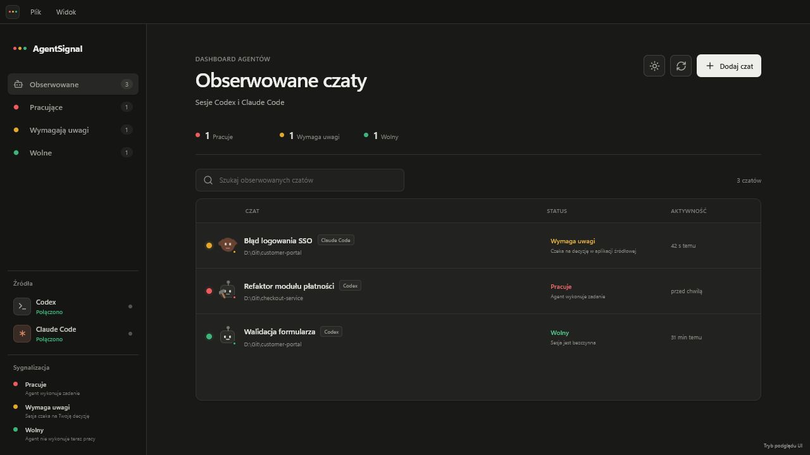
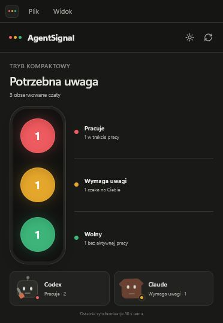

<p align="center">
  
</p>

<h1 align="center">AgentSignal</h1>

<p align="center">
  A calm, local desktop dashboard for monitoring selected Codex and Claude Code sessions.
</p>

<p align="center">
  
  
  
  
</p>

AgentSignal is not another chat client. It does not create tasks, send prompts,
or replace the official Codex and Claude Code applications. Instead, it lets
you choose existing sessions and keep their status visible in one focused
dashboard.



> All screenshots use demonstration data. They do not contain real
> conversations or paths from the author's computer.

## Features

- Track selected Codex and Claude Code sessions in one place.
- Automatically refresh status without sending prompts.
- Traffic-light states: working, needs attention, and idle.
- Distinct animated pets for Codex and Claude.
- Native notifications when a session needs attention or finishes working.
- Search and filter tracked conversations.
- Archive completed items, restore them later, or remove them from the
  dashboard archive.
- Light and dark themes.
- Compact aggregate traffic-light view.
- Persist tracked and archived sessions locally.
- Minimal interface designed to feel at home beside Codex.

### Add existing sessions

Select **Dodaj czat** (Add chat) to see sessions found in the local Codex and
Claude Code history. Selecting a session adds it only to the AgentSignal
dashboard.


Archiving or deleting an entry in AgentSignal never deletes the original
conversation. Permanent dashboard removal is intentionally available only
from the archive.

### Compact mode

Choose **Widok → Tryb kompaktowy** (View → Compact mode) to shrink AgentSignal
into a small traffic-light panel. It shows aggregate counts for every state
and an exact per-agent summary.

<p align="center">
  
</p>

## Status model

| Color | Status | Meaning |
| --- | --- | --- |
| Red | Working | The agent is currently executing a task. |
| Yellow | Needs attention | The session is waiting for a decision or user response. |
| Green | Idle | The agent is not currently working. |
| Gray | Unavailable | The current session state could not be confirmed. |

Codex exposes its session list through the local App Server. For tracked
conversations, AgentSignal also reads `task_started`, `task_complete`, and
`turn_aborted` events from the local JSONL history. This keeps long-running
tasks marked as active even when the log is briefly quiet.

Claude Code exposes local history through the official SDK's `listSessions`
method. Its working state is inferred from the time of the latest session
activity. Consumer Claude Chat and Cowork conversations are not imported.

## Installation

### Windows installer

1. Open the [latest AgentSignal release](https://github.com/mknizewski/agent-signal/releases/latest).
2. Download `AgentSignal-Setup-<version>.exe`.
3. Run the installer and choose an installation directory.

AgentSignal supports Windows 10 and Windows 11 on x64. It can run with Codex,
Claude Code, or both sources installed.

### Run from source

Requirements: Node.js 22+ and pnpm 11.

```powershell
git clone https://github.com/mknizewski/agent-signal.git
cd agent-signal
pnpm install
pnpm dev
```

Useful commands:

```powershell
pnpm typecheck       # TypeScript checks
pnpm test            # unit tests
pnpm test:sync-smoke # local provider integration smoke test
pnpm build           # production build
pnpm dist            # Windows installer in release/
```

## Privacy and security

AgentSignal is local-first:

- It has no AgentSignal backend or telemetry.
- It does not send conversation content to an AgentSignal server.
- It does not create agents or submit prompts.
- It does not modify or delete original sessions.
- It runs the Codex App Server locally over `stdio`.
- It uses the Claude SDK only to list local sessions.

Tracked and archived sessions are stored by Electron in
`agent-signal-state.json` inside the application's local data directory. That
file can contain titles, identifiers, and project paths for sessions added to
the dashboard. It is never included in this repository or uploaded by
AgentSignal.

The renderer runs with context isolation, sandboxing, and no Node.js access.
IPC is limited to explicitly defined and validated operations. The application
also uses a Content Security Policy, blocks new windows, and denies browser
permission requests.

See [SECURITY.md](SECURITY.md) for vulnerability reporting instructions.

## Project layout

```text
electron/        main process, provider detection, and synchronization
src/             React interface and shared status models
docs/screenshots README assets
scripts/         provider smoke test and icon generator
build/           application icon
```

## Current limitations

- Claude Code activity detection is based on the latest activity time.
- AgentSignal does not control agents or answer approval requests.
- Session history availability depends on the local Codex or Claude Code
  installation.
- The current installer targets Windows x64.

## License

[MIT](LICENSE)
