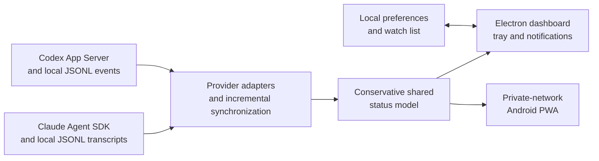

# Agent Signal: Product and Engineering Case Study

## Summary

Agent Signal is a local desktop dashboard for people who run several Codex and
Claude Code sessions at the same time.

The project started with a small but recurring problem: once multiple agents
are working in parallel, supervising them becomes an attention-management
task. A user repeatedly switches between windows to discover which session is
still working, which has finished, and which is blocked on an approval.

Agent Signal turns those separate conversations into one quiet status surface.
It does not replace either coding agent. It observes selected sessions, derives
a conservative state for each one, notifies the user when their attention is
needed, and opens the original conversation for further action.

## The problem

Parallel agents reduce execution time but introduce coordination overhead:

- work is distributed across providers, projects, and windows;
- a session waiting for approval can look similar to a long-running command;
- constantly checking every chat interrupts focused work;
- provider-specific interfaces do not offer one shared view;
- conversation data and local project paths can be sensitive.

The problem becomes noticeable when a user delegates several long-running
tasks and wants to step away from the individual chat windows without losing
awareness of their progress.

## Target user and core scenario

The primary user is a developer or technical power user who:

- runs Codex, Claude Code, or both;
- keeps several tasks active across multiple projects;
- needs to know where human input will unblock work;
- prefers local tooling over uploading conversation history to another service.

A representative flow is:

1. The user starts several agent tasks.
2. Agent Signal discovers the local conversations.
3. The user chooses the sessions worth watching.
4. The dashboard shows a small, shared state model across both providers.
5. A notification appears only when a meaningful state transition persists.
6. The user opens the original conversation and responds there.

## Product goals

- Make agent state scannable in a few seconds.
- Reduce unnecessary window switching.
- Direct attention to sessions that explicitly need user input.
- Support more than one agent provider without pretending their event models
  are identical.
- Keep source conversations and sensitive metadata on the user's computer.
- Remain observational: never send prompts, grant permissions, or modify source
  history.

## Non-goals

- Replacing Codex or Claude Code as a chat client.
- Automatically approving tool calls.
- Inferring detailed progress from generated text.
- Providing team analytics or cloud synchronization.
- Claiming certainty when a provider does not expose enough lifecycle data.

## Why a companion dashboard

The most important scope decision was to build a companion rather than another
agent client. Both providers already own the interaction surface, authentication,
execution environment, and approval flow. Reimplementing those systems would
increase security risk and make the project dependent on many more unstable
interfaces.

Agent Signal therefore owns only the layer that is missing between them:
cross-provider attention routing.

## System design

The Electron main process owns provider access, persistence, notifications, and
the optional mobile gateway. The renderer receives a validated, reduced
application snapshot through a narrow preload bridge. Provider-specific events
are normalized into four user-facing states:

| State | Meaning |
| --- | --- |
| Working | The source indicates that a turn is still executing. |
| Approval needed | An explicit approval or user-input request remains unresolved. |
| Idle | No turn is currently executing. |
| Unavailable | There is not enough reliable information to claim another state. |

## The hardest engineering problems

### 1. Deriving state without inventing certainty

The two providers expose different lifecycle information. Recent file activity
alone cannot distinguish a running command from a session waiting for input.
Agent Signal therefore prefers explicit events and matched tool-call lifecycles
over timing heuristics.

For watched Codex sessions, App Server state is combined with incremental local
event reads. A conversation enters **Approval needed** only for an explicit
waiting state or an unresolved permission/input request.

For watched Claude Code sessions, the local transcript is read incrementally.
An open turn remains **Working** until an explicit turn end, while unresolved
`AskUserQuestion` and `ExitPlanMode` calls map to **Approval needed**.

When reliable evidence is missing, the application reports **Unavailable**
rather than manufacturing a precise answer.

### 2. Incremental synchronization

Conversation logs can become large during long-running work. Re-reading every
file on every refresh would create unnecessary I/O and make status updates less
responsive. The synchronization layer keeps bounded per-session read state and
processes appended events while handling truncation, replacement, and malformed
records defensively.

### 3. Useful notifications without alert fatigue

An approval can be requested and automatically resolved within seconds. An
immediate notification would be technically correct but operationally noisy.
The dashboard updates immediately, while approval notifications use a short
debounce window. Startup baselines are established only after the initial
provider synchronization so old states do not produce a burst of historical
alerts.

### 4. Local mobile access without a hosted relay

The optional Android dashboard is served directly by the desktop application
on a private network. Service workers and Web Push require HTTPS, so the design
uses a per-installation local certificate authority, short-lived single-use QR
pairing, encrypted private keys, hashed device tokens, and a reduced mobile
payload.

This preserves the local-first boundary, but it also creates more onboarding
friction than a cloud account would. The feature is intentionally marked as a
preview.

### 5. Treating external data as untrusted

Session titles, project paths, transcript records, deep links, network requests,
and IPC inputs all cross trust boundaries. The desktop renderer is sandboxed
and has no direct Node.js access. The preload API is deliberately narrow, inputs
are validated again in the main process, navigation is restricted, and the
mobile API omits source identifiers, summaries, archives, and project paths.

## Key product decisions and trade-offs

| Decision | Benefit | Cost |
| --- | --- | --- |
| Observe rather than control agents | Smaller security surface and clear responsibility | Users must return to the source client to act |
| Require an explicit watch list | Calm dashboard focused on relevant work | One extra organization step |
| Use four conservative states | Consistent, quickly scannable UI | Less detail than raw provider timelines |
| Keep data local | Strong privacy story and no service dependency | No cross-machine cloud access |
| Use explicit local metadata for subagent relationships | Avoids false parent-child guesses across both providers | Child lifecycle detail can remain incomplete |
| Debounce only notifications, not visible status | Prevents noise without hiding current state | Notification timing is not instantaneous |
| Offer a private-network mobile PWA | Remote awareness without a hosted backend | Certificate installation and LAN restrictions |
| Add animated status characters | Makes state recognizable and gives the product identity | Visual personality must not obscure reliability |

## Quality and verification

The project treats status accuracy and boundary security as product behavior,
not implementation details. Verification includes:

- unit tests for provider normalization, state transitions, persistence,
  notification debouncing, pairing, and security rules;
- TypeScript checks for the renderer and Electron main process;
- provider synchronization smoke tests;
- a paired mobile-gateway smoke test;
- a packaged Windows application smoke test;
- manual visual checks for both languages, themes, compact mode, and installer.

Demonstration screenshots use generated project and conversation data so the
repository does not expose a real account, transcript, or local path.

## Outcome

The finished application covers the original problem end to end:

- it discovers existing Codex and Claude Code sessions;
- it attaches detected Codex and Claude Code subagents to their watched parent;
- normalizes their different lifecycle signals;
- groups selected work across projects;
- identifies persistent approval waits;
- routes the user back to the original conversation;
- provides desktop and optional mobile notifications;
- ships as a Windows installer with a local-first security model.

The main result is not the dashboard itself. It is a practical example of
designing a trustworthy product around incomplete, provider-owned data without
expanding into a full agent orchestration platform.

## What I would validate next

The next step is usage validation rather than more surface area:

- Do people running four or more simultaneous sessions keep the dashboard open?
- How often does a notification prevent an agent from waiting unnoticed?
- Which incorrect or unavailable states damage trust?
- Is observation sufficient, or is safe remote response the decisive feature?
- Does private-network mobile access justify its setup cost?

Answers to those questions should decide whether the product remains a focused
local utility or grows toward broader agent observability and team workflows.

## Lessons

- A shared status model should represent the strongest common evidence, not the
  richest provider-specific guess.
- Notification quality matters more than notification speed.
- Local-first design removes backend dependencies but does not remove security
  work.
- Honest unavailable states are more useful than confident false positives.
- Product scope is an architectural decision: declining to become another chat
  client kept the project focused on its actual problem.
